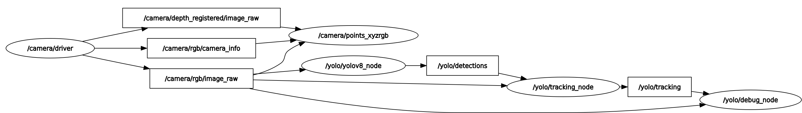
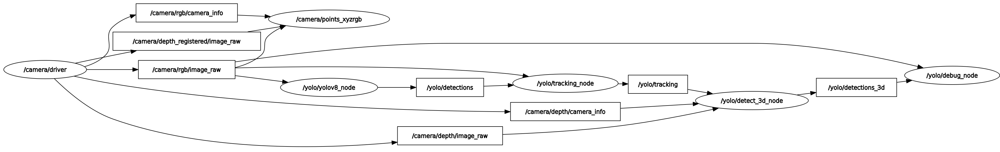

# yolov8_ros

ROS 2 wrap for [Ultralytics YOLOv8](https://github.com/ultralytics/ultralytics) to perform object detection and tracking, instance segmentation, human pose estimation and Oriented Bounding Box (OBB). There are also 3D versions of object detection, including instance segmentation, and human pose estimation based on depth images.

## Table of Contents

1. [Installation](#installation)
2. [Models](#models)
3. [Usage](#usage)
4. [Demos](#demos)

## Installation

```shell
$ cd ~/ros2_ws/src
$ git clone https://github.com/mgonzs13/yolov8_ros.git
$ pip3 install -r yolov8_ros/requirements.txt
$ cd ~/ros2_ws
$ rosdep install --from-paths src --ignore-src -r -y
$ colcon build
```

## Models

The available models for yolov8_ros are the following:

- [YOLOv8](https://docs.ultralytics.com/models/yolov8/)
- [YOLOv9](https://docs.ultralytics.com/models/yolov9/)
- [YOLOv10](https://docs.ultralytics.com/models/yolov10/)
- [YOLO-NAS](https://docs.ultralytics.com/models/yolo-nas/)

## Usage

### YOLOv8 / YOLOv9 / YOLOv10 / YOLO-NAS

```shell
$ ros2 launch yolov8_bringup yolov8.launch.py
```

```shell
$ ros2 launch yolov8_bringup yolov9.launch.py
```

<p align="center">
  
</p>

#### Topics

- **/yolo/detections**: Objects detected by YOLO using the RGB images. Each object contains a bounding boxes and a class name. It may also include a mak or a list of keypoints.
- **/yolo/tracking**: Objects detected and tracked from YOLO results. Each object is assigned a tracking ID.
- **/yolo/debug_image**: Debug images showing the detected and tracked objects. They can be visualized with rviz2.

#### Parameters

- **model_type**: Ultralytics model type (default: YOLO)
- **model**: YOLOv8 model (default: yolov8m.pt)
- **tracker**: Tracker file (default: bytetrack.yaml)
- **device**: GPU/CUDA (default: cuda:0)
- **enable**: Wether to start YOLOv8 enabled (default: True)
- **threshold**: Detection threshold (default: 0.5)
- **input_image_topic**: Camera topic of RGB images (default: /camera/rgb/image_raw)
- **image_reliability**: Reliability for the image topic: 0=system default, 1=Reliable, 2=Best Effort (default: 2)

### YOLOv8 3D

```shell
$ ros2 launch yolov8_bringup yolov8_3d.launch.py
```

<p align="center">
  
</p>

#### Topics

- **/yolo/detections**: Objects detected by YOLO using the RGB images. Each object contains a bounding boxes and a class name. It may also include a mak or a list of keypoints.
- **/yolo/tracking**: Objects detected and tracked from YOLO results. Each object is assigned a tracking ID.
- **/yolo/detections_3d**: 3D objects detected. YOLO results are used to crop the depth images to create the 3D bounding boxes and 3D keypoints.
- **/yolo/debug_image**: Debug images showing the detected and tracked objects. They can be visualized with rviz2.

#### Parameters

- **model_type**: Ultralytics model type (default: YOLO)
- **model**: YOLOv8 model (default: yolov8m.pt)
- **tracker**: tracker file (default: bytetrack.yaml)
- **device**: GPU/CUDA (default: cuda:0)
- **enable**: wether to start YOLOv8 enabled (default: True)
- **threshold**: detection threshold (default: 0.5)
- **input_image_topic**: camera topic of RGB images (default: /camera/rgb/image_raw)
- **image_reliability**: reliability for the image topic: 0=system default, 1=Reliable, 2=Best Effort (default: 2)
- **input_depth_topic**: camera topic of depth images (default: /camera/depth/image_raw)
- **depth_image_reliability**: reliability for the depth image topic: 0=system default, 1=Reliable, 2=Best Effort (default: 2)
- **input_depth_info_topic**: camera topic for info data (default: /camera/depth/camera_info)
- **depth_info_reliability**: reliability for the depth info topic: 0=system default, 1=Reliable, 2=Best Effort (default: 2)
- **depth_image_units_divisor**: divisor to convert the depth image into metres (default: 1000)
- **target_frame**: frame to transform the 3D boxes (default: base_link)
- **maximum_detection_threshold**: maximum detection threshold in the z axis (default: 0.3)

## Lifecycle nodes

Previous updates add Lifecycle Nodes support to all the nodes available in the package.
This implementation tries to reduce the workload in the unconfigured and inactive states by only loading the models and activating the subscriber on the active state.

These are some resource comparisons using the default yolov8m.pt model on a 30fps video stream.

| State    | CPU Usage (i7 12th Gen) | VRAM Usage | Bandwidth Usage |
| -------- | ----------------------- | ---------- | --------------- |
| Active   | 40-50% in one core      | 628 MB     | Up to 200 Mbps  |
| Inactive | ~5-7% in one core       | 338 MB     | 0-20 Kbps       |

## Demos

## Object Detection

This is the standard behavior of YOLOv8, which includes object tracking.

```shell
$ ros2 launch yolov8_bringup yolov8.launch.py
```

[](https://drive.google.com/file/d/1gTQt6soSIq1g2QmK7locHDiZ-8MqVl2w/view?usp=sharing)

## Instance Segmentation

Instance masks are the borders of the detected objects, not the all the pixels inside the masks.

```shell
$ ros2 launch yolov8_bringup yolov8.launch.py model:=yolov8m-seg.pt
```

[](https://drive.google.com/file/d/1dwArjDLSNkuOGIB0nSzZR6ABIOCJhAFq/view?usp=sharing)

## Human Pose

Online persons are detected along with their keypoints.

```shell
$ ros2 launch yolov8_bringup yolov8.launch.py model:=yolov8m-pose.pt
```

[](https://drive.google.com/file/d/1pRy9lLSXiFEVFpcbesMCzmTMEoUXGWgr/view?usp=sharing)

## 3D Object Detection

The 3D bounding boxes are calculated filtering the depth image data from an RGB-D camera using the 2D bounding box. Only objects with a 3D bounding box are visualized in the 2D image.

```shell
$ ros2 launch yolov8_bringup yolov8_3d.launch.py
```

[](https://drive.google.com/file/d/1ZcN_u9RB9_JKq37mdtpzXx3b44tlU-pr/view?usp=sharing)

## 3D Object Detection (Using Instance Segmentation Masks)

In this, the depth image data is filtered using the max and min values obtained from the instance masks. Only objects with a 3D bounding box are visualized in the 2D image.

```shell
$ ros2 launch yolov8_bringup yolov8_3d.launch.py model:=yolov8m-seg.pt
```

[](https://drive.google.com/file/d/1wVZgi5GLkAYxv3GmTxX5z-vB8RQdwqLP/view?usp=sharing)

## 3D Human Pose

Each keypoint is projected in the depth image and visualized using purple spheres. Only objects with a 3D bounding box are visualized in the 2D image.

```shell
$ ros2 launch yolov8_bringup yolov8_3d.launch.py model:=yolov8m-pose.pt
```

[](https://drive.google.com/file/d/1j4VjCAsOCx_mtM2KFPOLkpJogM0t227r/view?usp=sharing)
